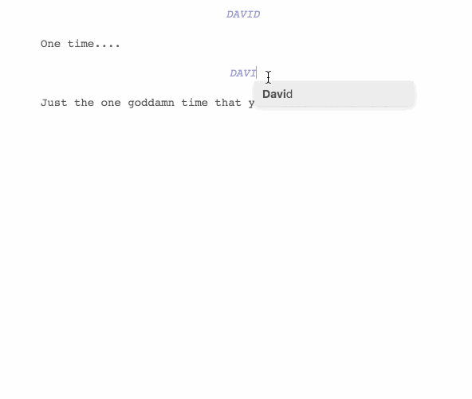
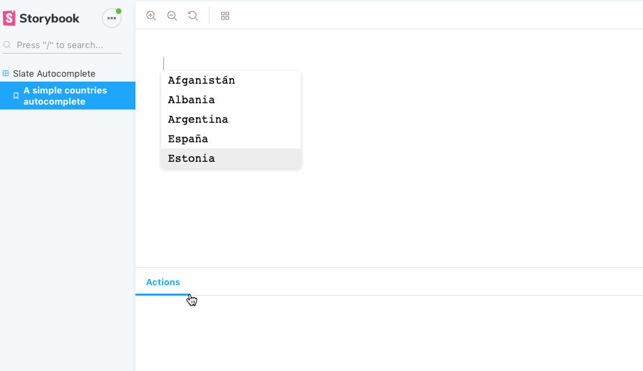

<h3 align="center"><code>slate-autocomplete</code></h3>

A [**Slate**](https://github.com/ianstormtaylor/slate) plugin to suggestion replacements or actions based on input. Useful for implementing autocomplete suggestions by node type.

<p align="center"></p>

---

### Install

With npm:

```
npm install --save slate-autocomplete
```

With yarn:

```
yarn add slate-autocomplete
```

_You will need to have installed `slate` as a dependency already._

---

### Usage

### Define your custom plugin:

#### With static suggestions:
```js
import autoCompletePlugin from 'slate-autocomplete'

const suggestions = [
  "Afganistán",
  "Albania",
  "Argentina",
  ...
]

export default autoCompletePlugin({
  suggestions,
  resultSize: 5,
  shouldHandleNode: (editor, currentNode) => true,
  onEnter: (suggestion, editor) => {
    replaceCurrentText(editor, suggestion)
  }
})
```

#### With dynamic suggestions:
```js
import autoCompletePlugin from 'slate-autocomplete'

export default autoCompletePlugin({
  renderPortal: (Portal, props) => (
    <YourDynamicComp>
      {names => (<Portal {...props} suggestions={names} />)}
    </YourDynamicComp>
  ),
  shouldHandleNode: (editor, currentNode) => true,
  onEnter: (suggestion, editor) => {
    replaceCurrentText(editor, suggestion)
  }
})
```
#### In this case, you need define `renderPortal` instead of `suggestions`.

```js
import customPlugin from 'your_plugin_path'
import { Editor } from 'slate-react'

const Example = ({ value, onChange, renderNode }) => (
  <React.Fragment>
    <Editor
      value={value}
      plugins={[customPlugin]}
      onChange={onChange}
      renderNode={renderNode}
    />
    {plugins.filter(({ component }) => !!component).map(({ component: Comp }, index) => <Comp key={index} />)}
  </React.Fragment>
)
```

Option | Type | Optional | Description
--- | --- | --- | ---
**`suggestions`** | `Array` | Yes | An array of suggestions.
**`resultSize`** | `Number` | Yes | An optional number use to set size of suggestion result.
**`renderPortal`** | `Function` | Yes | A function use to wrap the portal component with dynamics suggestions. 
**`onEnter`** | `Function` | No | A function use to handle return/enter keypress to append suggestion into editor.
**`shouldHandleNode`** | `Function` | No | A function use to know if the current slate node should be handled.

---

### Development

Clone the repository and then run:

```
yarn
yarn storybook
```

And open the example page in your browser:

```
http://localhost:6006/
```

You should see something like:

<p align="center"></p>